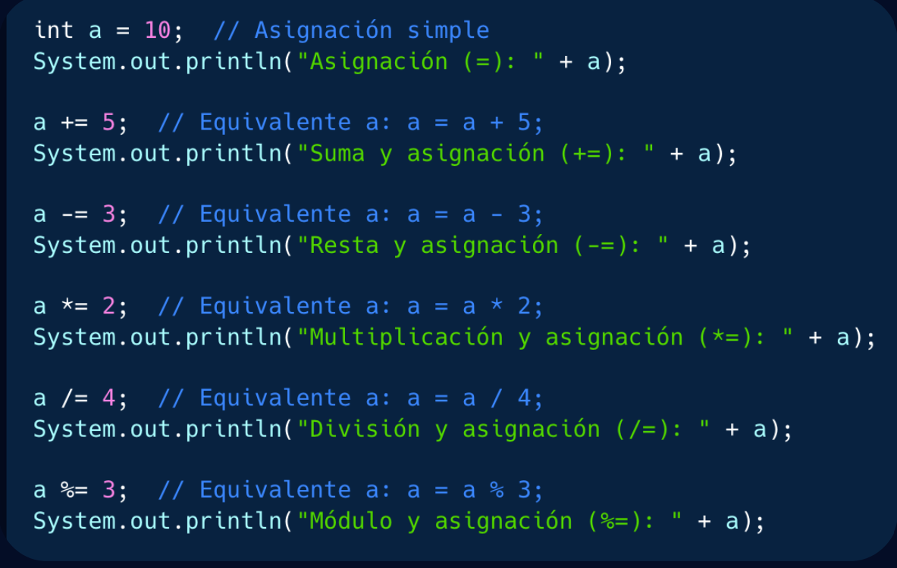
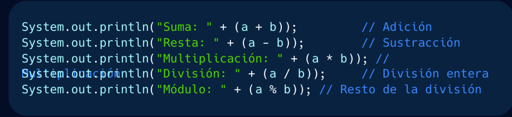
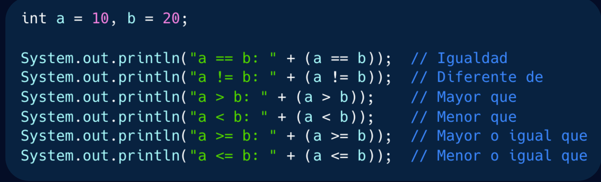
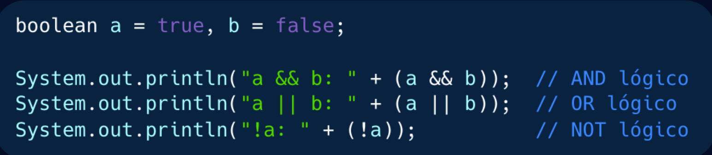
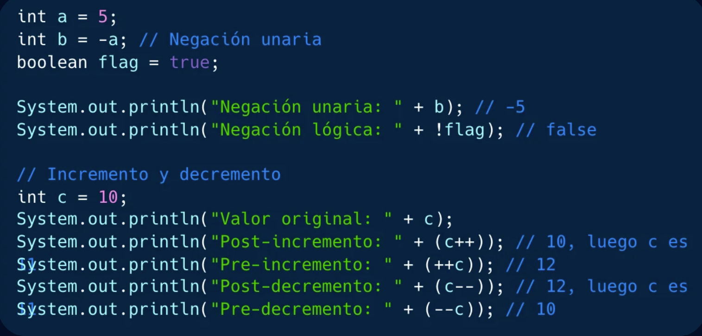
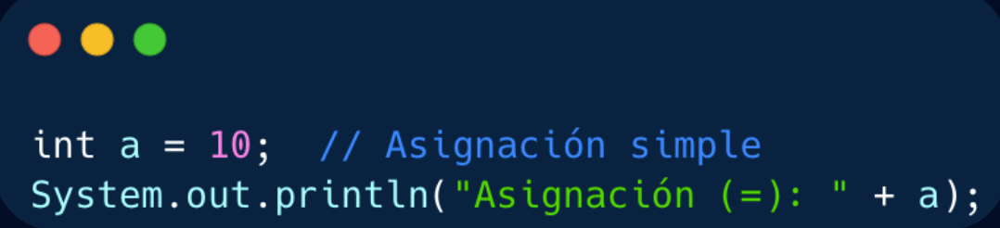
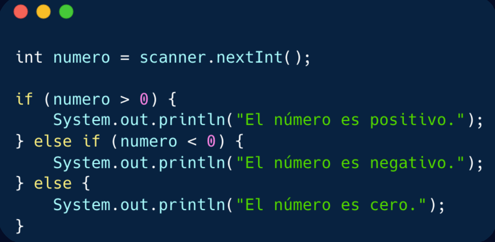
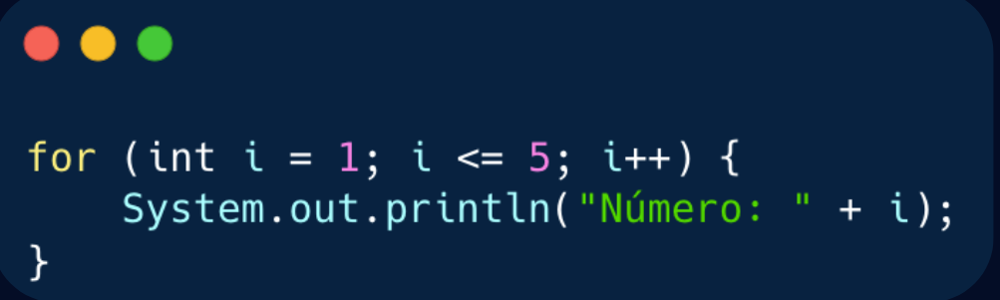

# Fundamentos del lenguaje

## Variables
Es un espacio en memoria RAM donde se almacenan un valor que se puede cambiar durante la ejecución del programa, por ejemplo:
```java
int age = 30;
```

## Constantes
Es un espacio en memoria RAM donde se almacena un valor que **no** puede cambiar durante la ejecución del programa, por ejemplo:
```java
final int AGE = 30;
```

## Reglas para definir nombres de variables y constantes

### Reglas obligatorias
01. No pueden contener espacios.
02. Deben comenzar con una letra, $ o _
03. Solo pueden contener letras, números, $ y _
04. No pueden ser palabras reservadas

### Reglas recomendadas para variables.
01. Usar camelCase.
02. Usar nombres significativos
03. Java es sensible a mayúsculas.
04. Evitar nombres largos.

### Reglas recomendadas para constantes.
01. Usar UPPER_CASE.
02. Elegir nombres significativos.
03. Java es sensible a mayúsculas.
04. Evitar nombres largos.

## Tipos de variables
Existen dos **categorías de datos principales**:
* Primitivos.
* Referencia.

### Datos primitivos
Son tipos de datos que contiene un solo valor.

#### Tabla de datos primitivos

| Tipo de Dato | Tamaño  | Valor por defecto | Uso común                              |
|--------------|---------|-------------------|----------------------------------------|
| byte         | 1 byte  | 0                 |Números pequeños (ahorro en memoria).   |
| short        | 2 bytes | 0                 | Números pequeños (más grandes de byte).|
| int          | 4 bytes | 0                 | Números enteros generales.             |
| long         | 8 bytes | 0L                | Números enteros muy grandes.           |
| float        | 4 bytes | 0.0f              | Números decimales con precisión simple.|
| double       | 8 bytes | 0.0d              | Números decimales con precisión doble. |
| char         | 2 bytes | \u0000            | Almacenar caracteres individuales.     |
| boolean      | 1 bit   | false             | Valores lógicos (verdadero / false)    |

#### Tipo de dato boolean
* Es de un solo bit.
* Expresa un único valor: Verdadero o Falso.

```java
boolean isLoading = false;
boolean isActive = false;
```

#### Tipo de datos char
* Usa el código UNICODE y ocupa cada carácter 16 bits.
```java
char aCharacter = 'a';
char oneCharacter = '1';
char unicode = '\u0021';
```

#### Tipos de datos: byte, short, int, long.
Guardan números enteros tanto positivos como negativos pero difieren en la presición 
```java
byte enteroByte = 127; // Rango máximo positivo de byte.
short enteroShort = 32767; // Rango máximo positivo de short.
int enteroInt = 2147483647; // Rango máximo positivo de int.
long enteroLong = 9223372036854775807L; //Rango máximo positivo de long.
```

#### Tipos de datos: float y double.
Son tipos de datos para representar números reales con presición simple (float) o doble (double)
```java
float valorFloat = 3.4028235e38f // Rango máximo positivo de float.
double valorDouble = 1.7976931348623157e308; // Rango máximo positivo de double.
```

### Operadores básicos
Los operadores son simbolos que permiten realizar operaciones en una o más variables, se agrupan en diferentes categorías según su función.

#### Operadores de asignación
Sirven para asignar valores a las variables: `=`, `+=`, `-=`, `*=`, `/=` y `%=`.


> Ejemplos de operadores de asignación

#### Operadores aritméticos
Permiten realizar operaciones matemáticas básicas con los signos `+`, `-`, `*`, `/` y `%`.

> Ejemplos de operadores aritméticos


#### Operadores relacionales
Comparan dos valores y devuelven un valor booleano (true o false), los operadoroes son: `>`, `<`, `>=`, `<=`, `!==` y `==`

> Ejemplos de operadores relacionales

#### Operadores lógicos
Permiten combinar expresiones booleanas para la toma de desiciones basadas el múltiples condiciones, los operadores son `&&`, `||`, `!`, `&` y `|`

> Ejemplos de operadores lógicos

#### Operadores unarios
Se le aplica un solo operador, los operadores son `++`, `--`, `+`, `-` y `~`

> Ejemplos de operadores unarios.


## Flujo de control
El flujo de control de Java se define como se ejecuta las instrucciones en un programa. Se divide en tres tipos principales:
* Secuencial.
* Condicional.
* Repetitivo.

### Secuencial.
Es un flujo básico: las instrucciones se ejecutan en el orden en que aparecen.

> Ejemplos de un código secuencial.

### Condicional
Permite tomar desiciones basadas en condiciones.

> Ejemplos de un código condicional.

### Repetitivo
Repite bloques de código mientras se cumpla una condición.

> Ejemplos de un código repetitivo.

